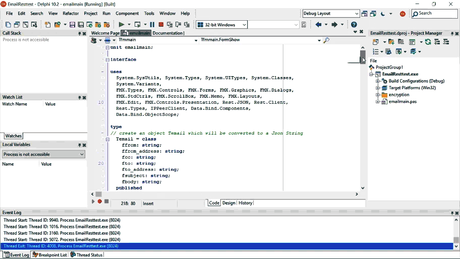
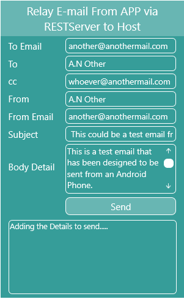

**Delphi Object directly to a Json string in a REST Client Example**

This blog is the result of an Android REST Client project which was used to
parse sensitive multiple email fields’ information to Json. Thereafter encrypted
and sent as base64 code to a HTTPS REST Server using SSL. The REST Service uses
an API key verification process.

I required a lightweight method for parsing Json. In my previous REST blogs all
data was laboriously parsed using multiple Json libraries, so I stumbled upon
another way that could lighten up the size of my Android APP with processed
code. REST has REST.JSON which is nice and lightweight and offers a function
“**ObjecttoJsonString**” conversion method. This library uses the not so light
System.Json library and the REST.JsonReflect library.

Check out the gif below which demonstrates the sending of an email to a client
via the REST Server. After receiving the REST post call. Note that this is
demonstrated using the Xampp and a PhP REST server operating in a localhost
environment.

**Further Info**

To find out more, check out my blog on this which offers further in-depth
explanation on how to use the code.

[Bayeseanblog](https://www.bayeseanblog.com/) (www.bayeseanblog.com)

Happy Reading
